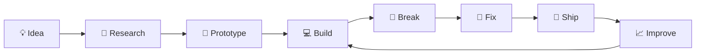

<div align="center">

# 👋 Hey, I'm Toprak

### `Developer` · `AI Engineer` 


<br/>

[](https://github.com/toprk-inik)
[](https://github.com/toprk-inik)
[](https://github.com/toprk-inik)

</div>

---

## 🧬 About Me

I'm **Toprak**! I am a builder which works with Python and C#!

I enjoy working at the intersection of **software, AI and automation**. I'm constantly experimenting with new tools, frameworks and workflows — especially when they let me build something that didn't exist before.

```text
┌──────────────────────────────────────────────────────────────┐
│                         TOPRAK.EXE                           │
├──────────────────────────────────────────────────────────────┤
│  🤖 Artificial Intelligence  → AI  / LLM / MCP              │
│  🌐 Product Development      → Web / SaaS                    │
│  ⚙️ Automation               → Developer Tooling             │
│  🧠 Learning                 → Build → Break → Understand    │
│  🚀 Current Mission          → Turn ideas into products      │
└──────────────────────────────────────────────────────────────┘
```

- 🚀 Building and experimenting with original projects
- 🎮 Learning deeper **Python and C#**
- 🤖 Exploring **AI agents, MCP and AI-powered workflows**
- 🌐 Building modern **web apps and SaaS products**
- 🛡️ Interested in **Ai LLMs**
- 🧪 I learn by actually building things

---

# ⚡ Tech Stack

### 👨‍💻 Languages

<p>

</p>

### 🌐 Web & Application Development

<p>

</p>

### 🤖 AI / Automation / Developer Tools

<p>

</p>

### 🛠️ Environment & Workflow

<p>

</p>

---

# 🚀 Featured Projects

## 🧠 Synapse AI Tutor

An AI-powered learning workspace focused on one simple principle:

> **Use AI to learn — not to avoid learning.**

Synapse AI Tutor is designed as a complete learning environment where students can bring their own material and turn it into interactive learning experiences.

### ✨ Planned / Core Features

| Feature | Description |
| --- | --- |
| 📚 AI Notes | Turn uploaded material into structured notes |
| 📝 AI Tests | Generate quizzes and practice questions |
| 👨‍🏫 AI Teacher | Explain concepts step-by-step |
| ✍️ Written Exams | Generate exam-style questions |
| 🧩 Fill in the Blank | Active-recall exercises |
| 📄 File Intelligence | Analyze PDF, DOCX, PPTX, XLSX & images |
| 🎯 Focus Mode | Distraction-free study workspace |
| 🔎 Global Search | Search across chats, notes and files |
| 📖 Citation Mode | Show sources used by the AI |
| 🧠 Knowledge Base | Build a persistent learning space |
| 📤 Import / Export | Move knowledge between platforms |
| 🖼️ Canvas | Infinite AI-assisted workspace |

**Stack:** `AI` `Web` `SaaS` `File Processing` `Knowledge Systems`

---

## 🤖 Vega Ai LLMs

Focusing on coding and chatting!

### 🎯 Planned Models

- vega-1-tiny (1.5B)
- vega-1-base (3B)
- vega-1-tiny-thinking (2B)
- vega-large-llm (7B)
- vega-1-tiny-large (5B)

**Goal:** being a friendly coding agent that runs on your local pc/phone/tablet or laptop.

---

# 🧪 What I'm Exploring

```text
AI & Agents       ████████████████████░░  90%
Web Development   ████████████████░░░░░░  75%
Automation        ███████████████░░░░░░░  70%
Software Design   ████████████░░░░░░░░░░  60%
```

> Percentages are just a fun visual — I'm always learning. 🚀

---

# 🧠 Current Learning Path

### 🤖 Artificial Intelligence

- AI agents
- MCP servers
- One-point focused LLMs
- AI-assisted development
- AI product architecture

### 🌐 Software Engineering

- Full-stack development
- SaaS architecture
- APIs & integrations
- Automation
- Developer experience

---

# 📊 GitHub Analytics

<div align="center">


<br/><br/>


</div>

---

# 📈 Contribution Activity

<div align="center">


</div>

---

# 🐍 Contribution Snake

<div align="center">


</div>

> If the snake doesn't render, the repository needs a GitHub Action that generates the SVG first.

---

# 🏗️ My Development Workflow



### My rule:

**Don't wait until you know everything. Build something, find what you don't know, then learn it.**

---

# 🔥 Things I Like Building

```diff
+ 🤖 AI-powered products
+ 🤖 AI LLMs
+ 🌐 SaaS platforms
+ 🛠️ Developer tools
+ ⚙️ Automation systems
+ 🧠 Learning systems
+ 🧪 Weird experiments
```

---

# 🌌 Developer Mindset

<div align="center">

### `BUILD → BREAK → DEBUG → LEARN → SHIP → REPEAT`

</div>

I don't believe learning has to happen before building.

Sometimes the fastest way to understand a technology is to **build something ambitious with it**, hit a wall, figure out why you're stuck, and come back stronger.

Every broken prototype is still progress.

---

# 🗺️ 2026 Roadmap

- [x] Start building real software projects
- [x] Explore AI-powered development
- [x] Experiment with MCP
- [x] Keep learning without stopping
- [ ] Continue building **Synapse AI Tutor**
- [ ] Publish more open-source projects
- [ ] Build something people actually use
- [ ] Build own LLM


---

# 💻 GitHub Profile Terminal

```bash
$ whoami
Toprak

$ cat mission.txt
Turn ideas into real products.

$ cat interests.txt
AI | Software | Automation | Open Source

$ cat philosophy.txt
Build. Break. Learn. Repeat.

$ ./future.sh
Building...
```

---

# 📫 Connect

<div align="center">

[](https://github.com/toprk-inik)

</div>

---

<div align="center">

### ⭐ If you find something interesting here, feel free to explore the repositories.


</div>
